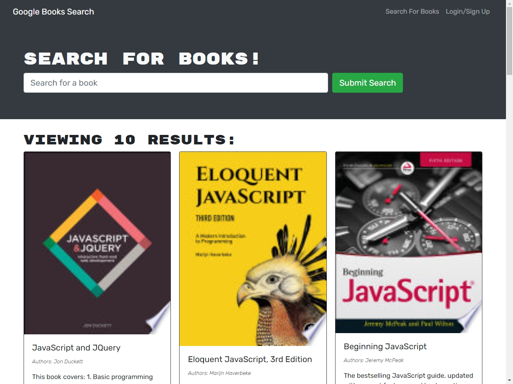

# inter-App

Interactive social networking API designed for any frontend platform. Ready, set, inter-App!

## Description

### Preview

This application is deployed at https://book-shelf-network.herokuapp.com/

The book-shelf-network is an easy-to-use digital bookshelf which is private to you. You can search for your favorite titles and let the Google Books Search engine do the heavy lifting. Once you find your read, save it to keep it on your book shelf. It will be there for you no matter what, and you can always remove it.

The app is built on MongoDB and is served via GraphQL. The entire front end is built with react and bootstrap. This makes for a very fast and efficient app with lighting-fast queries.

## Table of contents

- [Installation](#installation)
- [Usage](#usage)
- [Maintainers](#maintainers)
- [Contributing](#contributing)
- [Tests](#tests)
- [Credits](#credits)
- [License](#license)

## Installation

Note: This is only necessary if you intend on deploying the app yourself. Otherwise, enjoy the deployment on Heroku, no install required.

It is important that you have both node.js and MongoDB installed before attempting to install the rest of the application's dependencies and running it.

Clone the repo from GitHub first.

Begin by running `npm install` in your terminal. Once this is finished, the app should be ready to start.

## Usage

Run `npm run develop` in your terminal and wait for the app to display in your default browser. For troubleshooting, it is sometimes best to `cd` into either server or client directories and run `npm watch` or `npm start` respectively.

## Maintainer

[@Daniel Harned](https://github.com/DrDano)

Email: [danielharned@gmail.com](mailto:danielharned@gmail.com)

## Contributing

Fork the project if you would like to contribute.

## Credits

- [MongoDB](https://www.mongodb.com/)
- [GraphQL](https://graphql.org/)
- [Apollo GraphQL](https://www.apollographql.com/docs/)
- [React](https://reactjs.org/)

## License

Licensed under [MIT](https://choosealicense.com/licenses/mit) 2022

